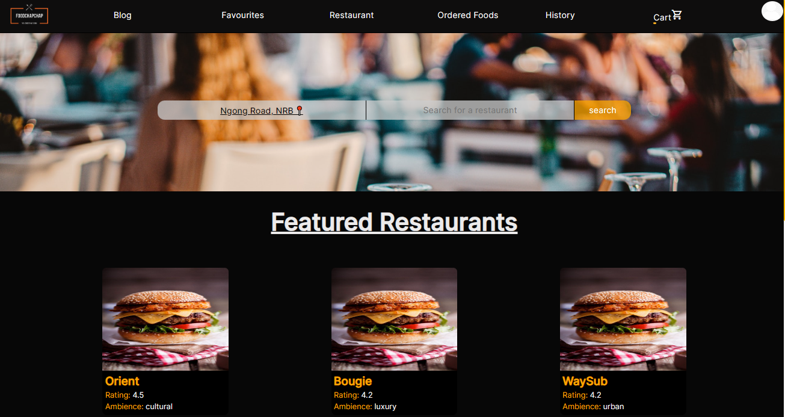
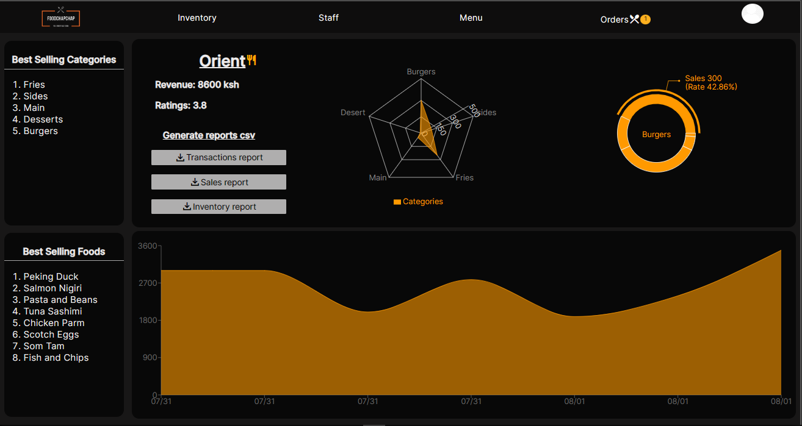
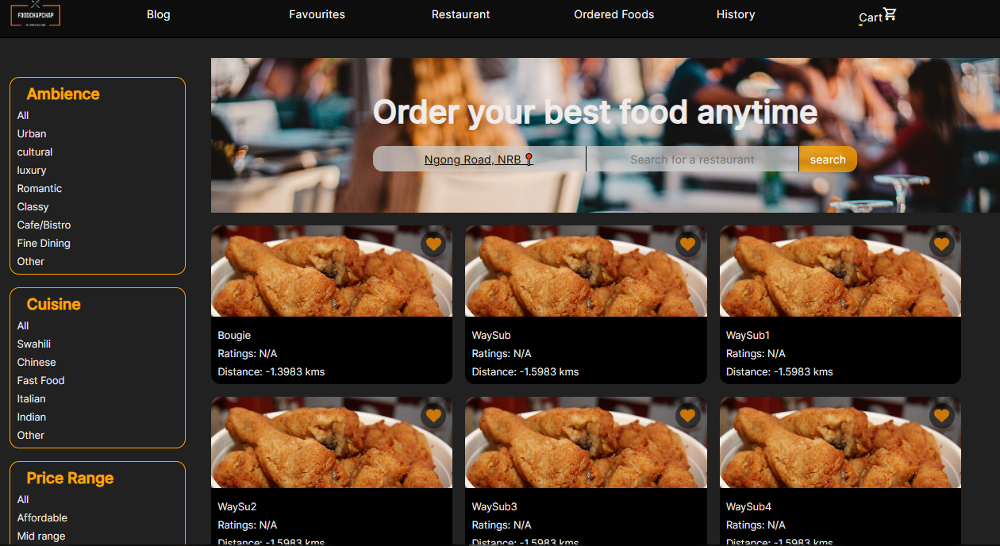
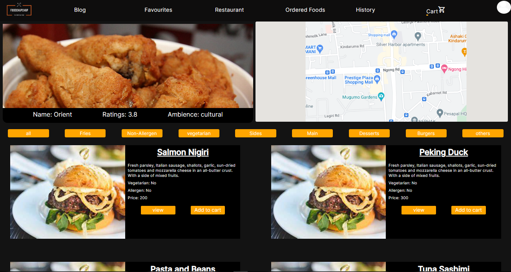
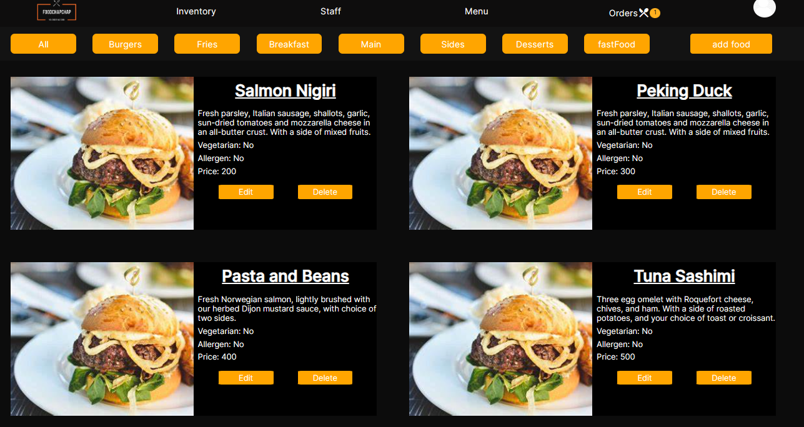

# [Food ChapChap](food-chapchap.vercel.app)

A web application that helps users manage their financial transactions and track their expenses. The application allows users to add and view transactions for their cards/sims and provides visual representations of their spending patterns. It also includes features such as user authentication, profile management, and savings tracking.

## Project backend

Link - **[Backend](https://github.com/edd-ie/foodBackend)**

## Table of Contents

1. [Getting started](#Getting-started)
2. [Feature](#feature)
   - [Homepage](#card_sim)
   - [Restaurant Dashboard](#categorization)
   - [Restaurants](#visual)
   - [Menu](#prof)
   - [Restaurant menu](#save)
3. [Contributors](#contributors)
4. [Licenses](#license)
5. [Technologies Used](#tech)

## <a id="Getting-started">Getting started</a>

### Direct access

You can access the site on **[Food ChapChap](food-chapchap.vercel.app)**

- Create an account and jump right in

### Cloning

**Clone** the project files to your local repository:

- HTTPS => `https://github.com/edd-ie/foodBackend.git`
- SSH => `git@github.com:edd-ie/foodBackend.git`
- Git CLI => `gh repo clone edd-ie/foodBackend`

Open the terminal and install all dependencies using.

```
npm install
```

In the terminal run this command to start the react app (accept the assigning of a new port if prompted)

```
npm run dev
```

## <a id="feature">Features</a>

### <a id="card_sim">Homepage</a>

Castomers can view the featured restaurants and foods while also being able to search for specific restaurants.



### <a id="categorization">Restaurant Dashboard</a>

Restaurant get access to the data visualization and reports, from food data to transaction data.



### <a id="visual">Restaurants</a>

Users can sort restaurants by different categories to fit their preferences.



### <a id="prof">Menu</a>

Users can see restaurant details and google maps location and each individual food item offered by the restaurant and they can view more details or add it to cart.



### <a id="save">Restaurant Menu</a>

The application allows restaurants to add, edit or delete foods on their menu offering



### <a id="contributors">Contributors</a>

This project was a team effort from the following individuals :

- [Edd.ie](https://github.com/edd-ie)
- [Glory](https://github.com/Nkathaglow)
- [Elizabeth]("https://github.com/elizabethkerubo02")
- [Mark]("https://github.com/markchweya")
- [Mohamed]("https://github.com/mohasalanka")

### <a id="license">Licenses</a>

The project is licensed under the [Eclipse Public License - v 2.0](./LICENSE)

### <a id="tech">Technologies Used</a>

The project is built using the following technologies:

- Front-end: React.js, React Router, Google Icons
- Back-end: Ruby on Rails
- Database: PostgreSQL
- Styling: Pure CSS
- Charting Libraries: Nivo, Emailjs, GoogleApi
